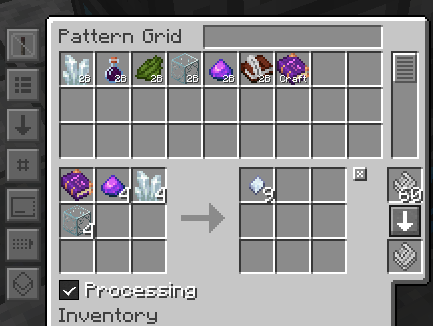

# Occultism: Automating Rituals

## Rituals

While not typically necessary to automate, Occultism rituals can be fully automated for on demand crafting. Custom rituals are used heavily in Expert mode, however, and knowing how to proceed will be a vital skill.

### The Pentacle

Each ritual uses one of several Pentacles as a base. Performing the ritual requires drawing out the appropriate pentacle, placing items in nearby Sacrificial Bowls, and finally placing the activation item in the Golden Sacrificial Bowls. Some require sacrificing a creature of some sort, and others require the player to use an item nearby. The former can still be automated with some difficulty. The latter, however, does need the player to actually use the item.

This setup will be built on a basic Refined Storage system. Basic knowledge of RS is assumed, but more information can be found [here](https://refinedmods.com/refined-storage/wiki/getting-started-with-autocrafting.html).

**What we need**

* 4x Modular Routers
  * 2x Puller Modules (MK2)
  * 1x Puller Module (MK1)
  * 3x Sender Modules (MK2)
  * 2x Distributor Modules
  * 1x Activator Module
  * 2x Detector Modules
  * 1x Vacuum Module
  * 4x Stack Upgrades
  * Optional:  Up to 36x Speed Upgrades
* 1x Auto Crafter
  * Most anything outside of Refined Storage will suffice, such as Thermal's Sequential Fabricator, Mekanism's Formulaic Assemblicator, or RFTools' Crafter. We'll use RFTools here for simplicity.
* 1x Refined Storage Crafter
* 1x Refined Storage Interface
* 1x Barrel
* 1x Precision Sawmill

There are a few peculiarities with Occultism and Refined storage that we're working around here. First, when Refined Storage requests a craft, it expects a very specific item to be returned. For flavor purposes, several items from Occultism crafting come back a little... randomly. Books of Binding, as well as many other crafted items, get assigned a name of a random spirit from the Dictionary of Spirits. This name is stored in NBT and each craft results in something different. Needless to say, Refined Storage doesn't really like this very much and will ignore inbound items simply because the NBT doesn't quite match up.

To deal with this we'll effectively have to move more of the craft outside of Refined Storage.&#x20;

Consider the following recipe:

.png>)

Both the activation item (Book of Binding) and the output (Dimensional Crystal Matrix) have extra random NBT on them. So we need to sort of trick Refined Storage when dealing with this craft. The first trick will be to use the plain unbound book in the crafting recipe; part of our automation will ensure it's properly bound before use. The second trick is that we don't really care about the Dimensional Crystal Matrix here; we really want Dimensional Storage Crystals, which are made by sawing up our precious matrix into pieces.&#x20;

Therefore, our pattern will start with the unbound book and return the final cut crystals as below.

### The Setup

.png>)

Above, we see the majority of the setup. The pattern itself is placed in the crafter facing the Barrel. We'll want this to be set to Pulse mode to ensure we're dealing with one craft at a time.

.png>)

Above this barrel is our first router. This will handle the initial item distribution.&#x20;

.png>)

1. Puller Module MK1 set to pull from below
2. Sender Module MK2 set to whitelist the Book of Binding and bound to our external crafter
3. 2x Distributor Modules set to blacklist the Book of Binding and bound to the various Sacrificial bowls. Each is bound to six of the twelve bowls needed for this recipe

Let's follow the book first. This is being sent over to the RFTools Crafter, which is configured to bind it to a spirit. The Dictionary of Spirits is kept in here, and the ExtC option is used to ensure that it's always available for the next craft. Other crafters would need more pipes or routers to handle moving this back to the input slots.&#x20;

.png>)

The craft is promptly completed and another router will handle it from here. This one is located beneath the Golden Sacrificial Bowl.

.png>)

1. Puller Module MK2 set to pull from the crafter
2. Detector Module set to Terminate on no Match
3. Activator Module set to Right Click in direction Up

It may be a little less obvious what this router is doing, so let's walk through it. First, it attempts to pull a book to it from the crafter. Whether this succeeds or not, it will continue to execute the other modules. The Detector Module is therefore acting as a gate; if the router is empty, no further modules are executed. If the router has an item, however, it proceeds through to the third step, right-clicking the item into the bowl.&#x20;

This is actually handling a few issues for us. First, it ensures that the Activator Module doesn't fire again after the craft has started, thereby _cancelling_ the craft and wasting any items that were already consumed. Second, it solves a potential timing issue: Occultism doesn't allow the activation item to be put in the golden bowl if it can't detect a recipe. By setting it up this way, the router will keep trying to insert the item until it succeeds, which means we don't need any special timing to ensure this book arrives after the rest of the bowls are full. It can simply arrive whenever.

By now, the other bowls ought to have been filled by the Distrobutor Modules with the rest of the items for the craft and the ritual will have begun. This part takes a few moments, but items should begin disappearing from the sacrificial bowls. Once complete, the Dimensional Crystal Matrix will pop out onto the ground. This is where the next router comes into play.

.png>)

1. Vacuum Module optionally whitelisted to the Dimensional Crystal Matrix
2. Sender Module MK2 set to send to our Precision Sawmill

This should promptly pick up the item and send it over for cutting. Our final router will then deal with pulling the results from the sawmill and simultaneously triggering the next craft.

.png>)

1. Puller Module MK2 set to pull from the Sawmill
2. Detector Module set to output a strong signal down (into the Crafter it's sitting on)
3. Sender Module MK2 set to send the result into the Interface

This final router is ensuring our system runs smoothly. It's sitting directly atop the crafter which is set to pulse mode, so when it receives the items from the sawmill, it outputs a redstone signal briefly, triggering the next craft. Note that the stack upgrades here are very important. Without them, we'd get a pulse for every one of the 9 returning crystals, thereby dumping 9 more crafts worth of materials in the barrel and completely breaking the automation.&#x20;

That about does it. At this point it should be possible to queue up a large batch and let it run. Each craft will happen with no further intervention.&#x20;

See it in action: [https://streamable.com/hbjbub](https://streamable.com/hbjbub)
